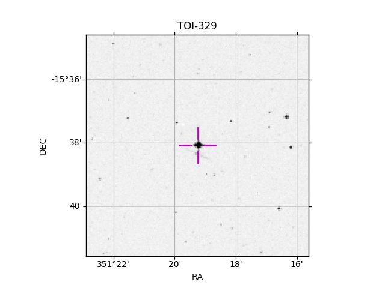

# FC_generator
Simple finding chart generator for astronomical observations. Create Finding Charts for observation purposes from a file containing the target list in the first column, and optionally the RA and DEC in columns 2 and 3 

### Parameters

**file**:    Either path to the file where the list of targets is or a target ID 
	 that can be resolved by Simbad.

### Optional parameters

**--COORD**:    By default it uses the target name to look for the target in Simbad
            If --COORD is provided, then it will use the coordinates in 
            Columns 2 and 3

**--fov**       Field of view to plot in the Finding Chart [arcmin]. Default = 7 

### Returns

Plots in jpeg 


### Examples
```
python FC_generator.py [path_to_file] --COORD --fov 5
```

<p align="center">
  
</p>